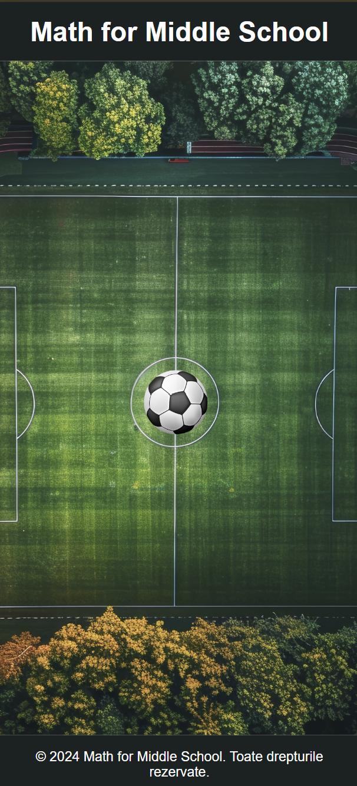
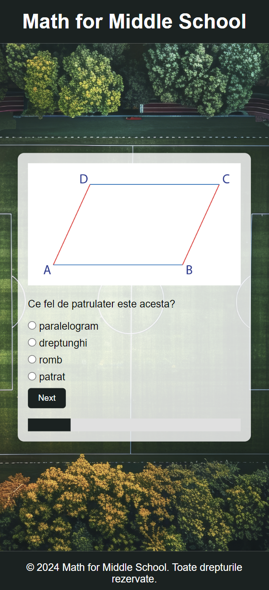
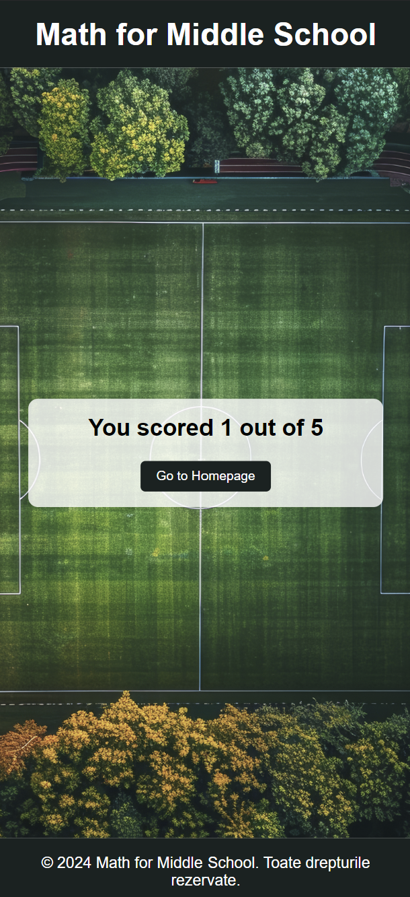

# Math for Middle School

**Math for Middle School** is a web-based tool designed to make learning mathematics easier and more engaging for middle school students. Inspired by a passionate young soccer player who doubted his ability to succeed in math, this project aims to prove that anyone can master mathematics with the right approach.

---

    
    
    

---

### ✨ Features
- **Interactive Quizzes:** Fun and challenging quizzes that reinforce key math concepts.
- **User-Friendly Design:** A clean and appealing interface tailored for young learners.
- **Progress Tracking:** Students can track their progress and see how much they've improved over time.

---

### 🎯 Why This Project?
This project is born out of the belief that every student has the potential to excel in math, regardless of their background or initial confidence. By combining educational content with a playful and supportive design, Math for Middle School helps students find the fun in learning and builds a solid foundation in mathematics. You just have to kick the ball to begin. ;)

---

### 🌐 Hosting Information
The website is currently hosted on a free web host, **InfinityFree**, and will be available online for a few months. Please note that this is a temporary setup, and the website may not be accessible after the hosting period expires.
